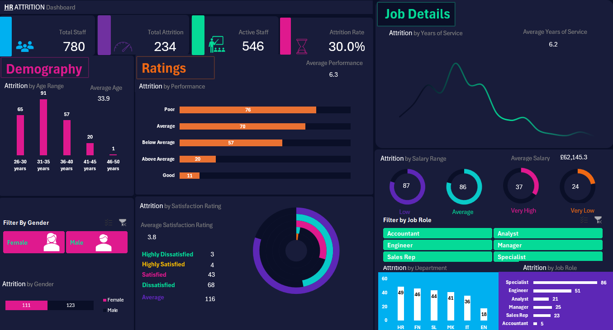

# Project 1
**Title:** [ATTRITION INTERACTIVE DASHBOARD](https://github.com/IbekweFavour/github.io/blob/main/Attrition%20Dashboard%20Analysis.xlsx)

**Tools Used:** PIVOT CHART, PIVOT TABLE, SLICERS, POWER QUERY, FUNCTIONS and Others

**Project Description:** 
# Employee Attrition Analysis

## 1. Project Overview

Employee attrition is a significant challenge for organisations across different industries. It refers to the reduction in an organisation's workforce when employees leave their jobs voluntarily or involuntarily. High employee attrition can lead to increased recruitment and training costs, loss of organisational knowledge, reduced productivity, and difficulties maintaining a stable workforce. Understanding why employees leave and identifying patterns associated with employee turnover can help organisations develop effective employee retention strategies.

This project focuses on **Employee Attrition Analysis Using Excel**, with the aim of examining employee demographic information, job related characteristics, years of service, performance ratings, satisfaction scores and salary information to understand the factors associated with employee attrition. The project uses an employee dataset containing 15 columns: EmployeeID, Age, Age Range, Gender, Department, Job Role, Years of Service, Performance Rating, Performance Range, Satisfaction Score, Satisfaction Range, Salary, Salary Range, Attrition and Attrition Count. These variables provide an opportunity to investigate employee characteristics, compare attrition patterns across different employee groups and identify possible relationships between workplace satisfaction, compensation, performance, length of service and employees leaving the organ

## 2. Problem Statement

Employee attrition can create operational and financial challenges for organisations, particularly when experienced employees leave unexpectedly. However, organisations may struggle to identify the employee groups experiencing higher attrition rates and the factors associated with their decisions to leave. Without systematic analysis, human resource departments may rely on assumptions rather than evidence when developing retention strategies. For example, they may not know whether attrition is more common in particular departments, job roles, age groups, salary ranges, or service-length categories. They may also lack a clear understanding of how employee satisfaction and performance ratings relate to attrition. This project addresses the problem by analysing employee data to identify patterns and relationships associated with attrition. It seeks to provide a clearer understanding of the characteristics of employees who leave the organisation compared with those who remain. The findings can help human resource professionals investigate potential areas of concern and develop more targeted retention initiatives.

## 3. Project Aim

The main aim of this project is to analyse employee demographic, professional, performance, satisfaction and salary data to identify patterns associated with employee attrition and develop data-driven insights that can support employee retention and workforce planning.

## 5. Dataset Description

The dataset contains 15 columns representing employee identifiers, demographic characteristics, employment details, performance, satisfaction, compensation, and attrition information.

| Column | Description | Analytical purpose |
|---|---|---|
| EmployeeID | Unique identifier assigned to each employee | Identify records and check for duplicates |
| Age | Employee's age | Examine demographic patterns in attrition |
| Age Range | Grouped age categories | Compare attrition across age groups |
| Gender | Employee's recorded gender category | Examine attrition patterns across gender categories |
| Department | Department in which the employee works or worked | Identify departments with different attrition patterns |
| Job Role | Employee's job position or role | Compare attrition across job roles |
| Years of Service | Length of time the employee has served the organisation | Investigate attrition by employment tenure |
| Performance Rating | Recorded employee performance rating | Examine the association between performance and attrition |
| Performance Range | Grouped performance categories | Compare attrition across performance levels |
| Satisfaction Score | Numerical employee satisfaction measure | Explore the association between satisfaction and attrition |
| Satisfaction Range | Grouped satisfaction categories | Identify satisfaction groups with different attrition patterns |
| Salary | Employee salary amount | Examine compensation patterns and differences |
| Salary Range | Grouped salary categories | Compare attrition across salary bands |
| Attrition | Indicates whether an employee has left or remained, according to the dataset's coding | Main outcome variable for attrition analysis and potential prediction |
| Attrition Count | A count or indicator associated with attrition | Summarise attrition records, subject to verification of its definition |

**Key findings:** 
Regional Profitability: Identified the most profitable countries and highlighted regions where performance could be improved.
Seasonal Trends: Revealed patterns in sales and profit that correspond with seasonal events, allowing for more strategic planning.
Top-Performing Products: Highlighted which cookie products are driving the most revenue and profit, aiding in inventory and marketing decisions.
Sales Volatility: Analyzed monthly sales fluctuations to understand market dynamics and adjust business strategies accordingly.
This dashboard serves as a crucial tool for the cookies company’s management team, providing clear, actionable insights that drive informed decision-making and strategic planning.

**Dashboard Overview:**

# PROJECT 2
**Title:**

**SQL Code:**

**SQL Skills Used:**

**Project Description:**

**Technology used: SQL server**

Data Retrieval (SELECT): Queried and extracted specific information from the database.
Data Aggregation (SUM, COUNT): Calculated totals, such as sales and quantities, and counted records to analyze data trends.
Data Filtering (WHERE, BETWEEN, IN, AND): Applied filters to select relevant data, including filtering by ranges and lists.
Data Source Specification (FROM): Specified the tables used as data sources for retrieval

